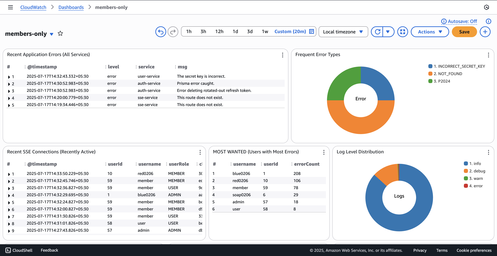
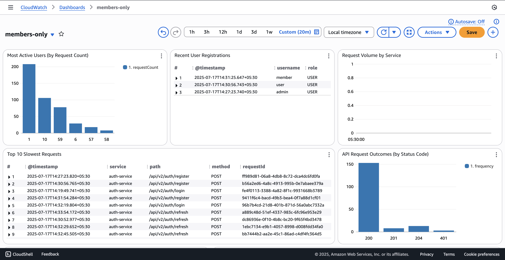
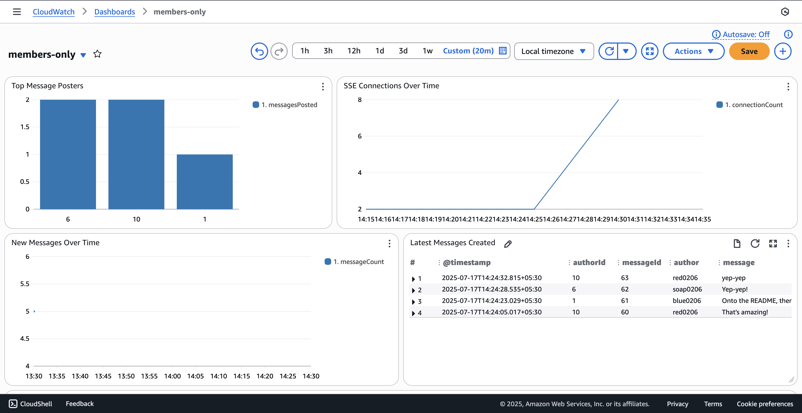
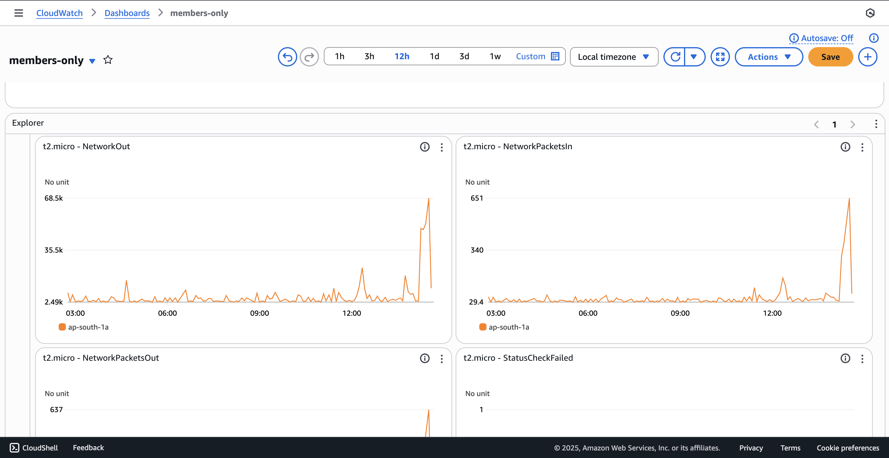

# Members Only - Serverless Backend

This repository contains the backend infrastructure for the **Members Only** application, a real-time message board. This backend is created using a serverless-first, microservice-oriented approach on AWS to build a scalable, and cost-effective system.

**Live Frontend:** **[cloud.nevery.shop](https://cloud.nevery.shop)**  
**Live API Base URL:** `https://api-v2.nevery.shop/api/v2`  
**Live SSE Endpoint:** `https://event.nevery.shop/api/v2/events`

---

## Table of Contents

- [Members Only - Serverless Backend](#members-only---serverless-backend)
  - [Table of Contents](#table-of-contents)
  - [Architectural Overview](#architectural-overview)
    - [High-Level Flow](#high-level-flow)
    - [Core Components](#core-components)
  - [Key Features \& Technical Highlights](#key-features--technical-highlights)
  - [Tech Stack \& Key Decisions](#tech-stack--key-decisions)
  - [Monitoring \& Observability](#monitoring--observability)
  - [Project Structure](#project-structure)
  - [Deployment \& CI/CD](#deployment--cicd)
  - [API Documentation](#api-documentation)
  - [The Monolithic Version](#the-monolithic-version)

---

## Architectural Overview

This backend is a distributed system built on modern cloud principles. This architecture separates stateless API logic from stateful real-time connections, using the best AWS service for each job (within free-tier 🌚).

### High-Level Flow

This diagram illustrates the high-level flow of data between the client, our various backend services, and external APIs.

### Core Components

1.  **Serverless REST API (AWS Lambda & API Gateway)**
    The core REST API is built as a set of independent microservices running on **AWS Lambda**. An **Amazon API Gateway** serves as the single entry point (`api-v2.nevery.shop`), routing requests to the appropriate Lambda function (`auth-service`, `messages-service`, etc.). This serverless approach provides immense scalability and cost-efficiency.

2.  **Stateful Real-Time Service (EC2, Nginx & Redis)**
    Real-time updates are handled by a dedicated, long-running Node.js server deployed on an **Amazon EC2** instance to manage persistent Server-Sent Events (SSE) connections.

    - **Nginx & SSL:** Nginx is used as a reverse proxy to handle HTTPS traffic, using a free **Let's Encrypt** certificate for the `event.nevery.shop` domain. It proxies requests to the underlying Node.js application.
    - **Inter-Service Communication:** When a Lambda function needs to dispatch an event (e.g., a new message is created), it makes a secure, internal API call to the SSE server.
    - **Scalability & State:** To support scaling to multiple instances, the SSE server uses **Amazon ElastiCache (Valkey Engine)** as a Pub/Sub. This decouples the server instances, allowing any instance to publish an event that will be broadcast to clients connected to _any other_ instance.

3.  **Asynchronous Workers (SQS & EventBridge)**
    To keep the API fast, non-critical tasks are offloaded to asynchronous workers.

    - **User Activity:** API requests publish a message to an **Amazon SQS** queue. A separate Lambda worker processes these messages in batches to efficiently update user activity timestamps.
    - **Scheduled Cleanup:** An **Amazon EventBridge Scheduler** triggers a Lambda function daily to perform maintenance, such as clearing expired refresh tokens from the database.

4.  **Secure Private Networking (VPC & NAT Instance)**
    All compute resources (Lambdas, EC2, RDS, ElastiCache) reside within a custom **Amazon VPC**.
    - The Lambdas and database are in **private subnets**, making them inaccessible from the public internet.
    * The EC2 instance is placed in a **public subnet** and is configured to also act as a **NAT Instance**. It uses IP forwarding and `iptables` to provide secure internet egress for the private Lambda functions, allowing them to call external APIs (like Cloudinary) without needing costly NAT Gateways.

---

## Key Features & Technical Highlights

- **Robust Authentication:** Secure JWT system with short-lived Access Tokens and long-lived Refresh Tokens. Refresh tokens are stored hashed in the database, use `jti` for precise revocation, and are managed via secure, `HttpOnly` cookies. This has also been used to implement session-management features like "Logout a Specific Device".
- **CSRF Protection:** A Double Submit Cookie pattern is implemented to protect state-changing endpoints. The frontend sends a custom `x-csrf-token` header that is validated by the backend.
- **Role-Based Access Control (RBAC):** Clear separation of permissions for `USER`, `MEMBER`, and `ADMIN` roles, enforced by middleware.
- **Centralized & Validated Configuration:** All microservices utilize a shared `core-utils` package with Zod for robust validation of environment variables.
- **Infrastructure as Code (IaC):** The entire AWS infrastructure (API Gateway, Lambdas, SQS, EventBridge, IAM Roles, VPC networking) is defined declaratively (with the exception of EC2) using the **AWS CDK** in TypeScript, ensuring a repeatable and version-controlled environment.

---

## Tech Stack & Key Decisions

| Category            | Technology / Pattern             | Rationale                                                                                                                      |
| :------------------ | :------------------------------- | :----------------------------------------------------------------------------------------------------------------------------- |
| **Compute**         | **AWS Lambda** & **EC2**         | Used the right tool for the job: serverless for stateless REST APIs and a persistent EC2 instance for the stateful SSE server. |
| **API Layer**       | **Amazon API Gateway**           | Provides a single, secure entry point for all REST services, handling CORS, custom domains, and routing.                       |
| **Database**        | **PostgreSQL (Amazon RDS)**      | A robust, relational database for core application data, managed by AWS for reliability.                                       |
| **ORM**             | **Prisma**                       | For best-in-class TypeScript integration, type safety, and a modern developer experience.                                      |
| **Real-Time State** | **Amazon ElastiCache**           | A high-performance in-memory cache used for Pub/Sub to enable communication between distributed SSE server instances.          |
| **Async Tasks**     | **Amazon SQS** & **EventBridge** | Decoupled non-critical tasks (activity tracking) and scheduled jobs to ensure the API remains fast and responsive.             |
| **Networking**      | **Custom VPC with NAT Instance** | Designed a secure network with private subnets for Lambdas/DB and used a cost-effective EC2 NAT instance for internet egress.  |
| **IaC**             | **AWS CDK (TypeScript)**         | All AWS infrastructure is defined as code for repeatable, version-controlled, and automated deployments.                       |
| **Monorepo**        | **pnpm Workspaces**              | To manage shared code (`core-utils`, `database`) and ensure consistency across microservices.                                  |

---

## Monitoring & Observability

The system is configured for centralized logging and monitoring in **Amazon CloudWatch**.

- All services, including the Lambda functions and the `pm2`-managed process on the EC2 instance, output structured JSON logs using **Pino**.
- The **CloudWatch Agent** is configured on the EC2 instance to stream these logs to CloudWatch.
- This enables a unified view of the entire system's health.

**Dashboard:**

---

## Project Structure

This is a `pnpm` monorepo containing the following key directories:

- **/infrastructure:** The AWS CDK project that defines and deploys all cloud resources.
- **/packages:** Contains all the individual application packages/services.
    - `/auth-service`, `/messages-service`, `/users-service`: The serverless REST API microservices.
    - `/activity-service`, `/cleanup-service`: The asynchronous worker Lambdas.
    - `/sse-service`: The stateful Express server for SSE, deployed on EC2.
    - `/database`: Shared package for the Prisma schema and client.
    - `/core-utils`: Shared library for common errors, logger, config, etc.

---

## Deployment & CI/CD

- **Serverless Services:** The entire serverless stack (API Gateway, Lambdas, SQS, etc.) is deployed with a single command (`cdk deploy`) from the `/infrastructure` package.
- **Stateful Service (SSE on EC2):** Currently not automated. I plan to configure a **GitHub Actions** workflow to provide a CI/CD pipeline for the SSE server.

---

## API Documentation

For a detailed contract of all DTOs and API response shapes, please refer to the README of the public npm package.

- **Shared Types Package:** [@blue0206/members-only-shared-types](https://github.com/blue0206/members-only-shared-types)

---

## The Monolithic Version

This serverless project is an architectural evolution of an initial, robust monolith. The original version, which demonstrates a classic layered architecture deployed as a single container, is preserved for reference and can be found on the `monolith-deployment` branches of the backend and frontend repositories.

- **Live Monolith Frontend:** [app.nevery.shop](https://app.nevery.shop) (Backend on Render; Wait time >= 4 minutes)
- **Monolith Backend Repo Branch:** [Monolith Backend](https://github.com/blue0206/members-only-backend/tree/monolith-deployment)
- **Monolith Frontend Repo Branch:** [Monolith Frontend](https://github.com/blue0206/members-only-frontend/tree/monolith-deployment)

---

_This project is built by Aayush Rai (blue0206)._
